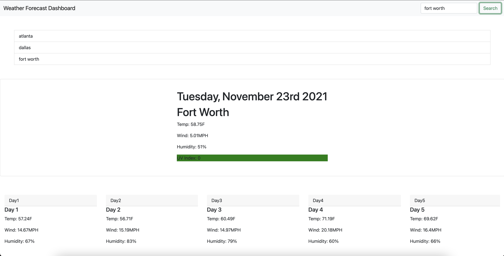

# Unit 6 Homework - Weather Dashboard

## Application Description
For this assignment, I created a weather dashboard that displayed the weather of any city the user searches for. I created a series of functions and fetch requests to gather information for the current day's weather information and the following five days' weather information. These functions and fetch requests gather information from the Open Weather Map API's and displays it to the various cards on the webpage. When the user searches for a city, one large card will appear displaying the current day's temperature, wind speed, humidity, and UV index. Below that, 5 more cards will appear displaying the temperature, wind speed, and humidity for the following five days. Within my code, I changed the units to imperial and added a colored background to the UV index for the current day depending on the UV index's severity. Additionally, I stored the searched city into local storage and displayed that value in a button at the top of the page.

GitHub Repository Link: https://github.com/MattReynolds53/Forecast-Dashboard

GitHub Pages Link: https://mattreynolds53.github.io/Forecast-Dashboard/

## Screenshots

